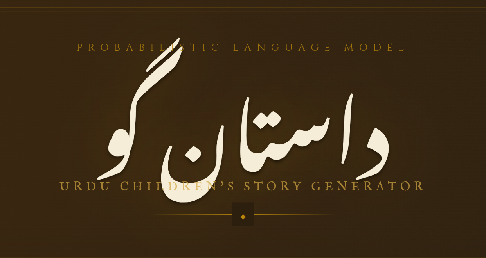
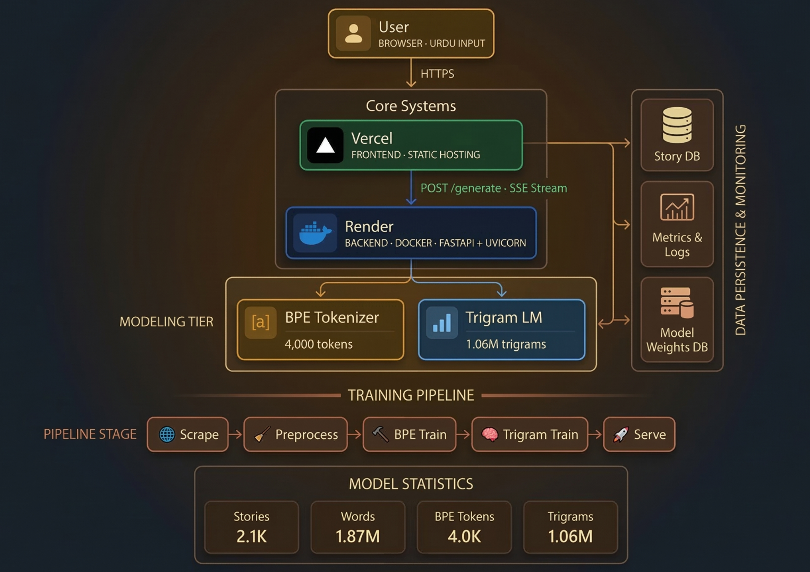

# داستان گو — Urdu Children's Story Generator



> A fully probabilistic AI system that generates Urdu children's stories using a custom BPE tokenizer and Trigram Language Model with Deleted Interpolation — deployed as a containerized microservice with a ChatGPT-like streaming frontend.

---

## 📸 Demo


> *Type an Urdu opening line, hit داستان سنائیں, and watch your story unfold word by word.*

TRY NOW : https://urdu-story-generation-eight.vercel.app/

---

## 🏗️ Architecture



---

## 🚀 Live Demo

| Service | URL |
|---|---|
| 🌐 Frontend | [urdu-story-generator.vercel.app](https://urdu-story-generator.vercel.app) |
| ⚙️ Backend API | [probabilistic-urdu-story-generation.onrender.com](https://probabilistic-urdu-story-generation.onrender.com) |
| 📖 API Docs | [/docs](https://probabilistic-urdu-story-generation.onrender.com/docs) |

---

## 📁 Project Structure

```
probabilistic-urdu-story-generation/
│
├── frontend/
│   └── index.html              # Single-file React-less frontend
│
├── src/
│   ├── train_bpe.py            # BPE tokenizer training
│   ├── train_trigram.py        # Trigram LM training with interpolation
│   └── serve.py                # FastAPI inference server
│
├── model/
│   ├── bpe_merges.json         # Learned BPE merge rules
│   ├── bpe_vocabulary.txt      # Final BPE vocabulary
│   ├── master_corpus.txt       # Preprocessed training corpus
│   └── trigram_model.pkl       # Trained trigram model (30MB)
│
├── preprocessed/
│   └── final_clean_stories.txt # Cleaned Urdu story corpus
│
├── scrapper/
│   ├── scrapper.py             # Web scraper for Urdu stories
│   └── full_urdu_corpus.txt    # Raw scraped corpus
│
├── Dockerfile                  # Production Docker image
├── requirements.txt            # Python dependencies
├── Makefile                    # Build automation
└── .github/
    └── workflows/
        └── ci.yml              # GitHub Actions CI/CD
```

---

## ⚙️ Phases

### Phase I — Data Collection & Preprocessing

- Scraped **2,143 Urdu children's stories** (~1.87M words) from online sources
- Removed HTML, ads, non-Urdu characters, normalized Unicode
- Added special tokens:

| Token | Unicode | Purpose |
|---|---|---|
| `<EOS>` | `\uE000` | End of Sentence |
| `<EOP>` | `\uE001` | End of Paragraph |
| `<EOT>` | `\uE002` | End of Story |

---

### Phase II — BPE Tokenizer

A **from-scratch** Byte Pair Encoding tokenizer trained on the Urdu corpus. No pre-built tokenizer libraries used.

**Key stats:**
- Base character vocabulary: **80 characters**
- Target vocabulary size: **4,000 tokens**
- Merge operations: **3,920**
- Tokenization speed: ~215K words/sec (optimized with merge rank lookup)

**Training:**
```bash
make bpe
```

**How it works:**

1. Corpus is split into words, each word represented as individual characters
2. Most frequent adjacent character pair is found across all words
3. That pair is merged into a single token across the vocabulary
4. Repeat until target vocabulary size is reached
5. Merge rules saved to `model/bpe_merges.json`

**Sample merges learned:**

| Merge | Result |
|---|---|
| `م` + `یں` | `میں` |
| `ہ` + `ے` | `ہے` |
| `سا` + `تھ` | `ساتھ` |
| `شہزا` + `دوں` | `شہزادوں` |
| `خوف` + `زدہ` | `خوفزدہ` |

---

### Phase III — Trigram Language Model

A **Maximum Likelihood Estimation (MLE)** trigram model with **Deleted Interpolation** for smoothing.

**Key stats:**
- Unigrams: **3,986**
- Bigrams: **322,324**
- Trigrams: **1,065,071**
- Interpolation weights learned on **10% held-out data**

**Training:**
```bash
make trigram
```

**Interpolation:**

The model combines three probability estimates:

```
P(w3 | w1, w2) = λ3·P_MLE(w3|w1,w2) + λ2·P_MLE(w3|w2) + λ1·P_MLE(w3)
```

Weights are estimated via the **Deleted Interpolation algorithm (Jelinek & Mercer, 1980)**:

| Weight | Value | Interpretation |
|---|---|---|
| λ1 (unigram) | 0.2123 | 21% weight on unigram |
| λ2 (bigram) | 0.6692 | 67% weight on bigram |
| λ3 (trigram) | 0.1184 | 12% weight on trigram |

The bigram dominates because trigram coverage is sparse relative to the corpus size.

---

### Phase IV — Microservice & Containerization

**FastAPI** REST service with Server-Sent Events (SSE) streaming.

**Endpoints:**

| Method | Endpoint | Description |
|---|---|---|
| GET | `/health` | Health check + model stats |
| POST | `/generate` | Stream story word-by-word (SSE) |
| POST | `/generate/full` | Return complete story at once |

**Request schema:**
```json
{
  "prefix": "ایک دفعہ کا ذکر ہے کہ",
  "max_length": 200,
  "temperature": 1.0
}
```

**Run locally:**
```bash
make serve
```

**Docker:**
```bash
docker build -t urdu-story-generator .
docker run -p 8000:8000 urdu-story-generator
```

---

### Phase V — Frontend

A single-file classical Urdu manuscript-themed UI. No framework, no build step.

**Features:**
- Word-by-word streaming with blinking cursor (ChatGPT-style)
- Adjustable max length (50–400 tokens)
- Adjustable temperature (0.1–2.0) for creativity control
- Copy to clipboard
- Responsive — works on mobile
- RTL Urdu layout with **Noto Nastaliq Urdu** font
- Classical parchment color palette with gold accents

---

### Phase VI — Cloud Deployment

| Layer | Platform | Notes |
|---|---|---|
| Frontend | **Vercel** | Auto-deploy on push to `main` |
| Backend | **Render** | Docker container, free tier |
| CI/CD | **GitHub Actions** | Builds & pushes Docker image on `main` push |

---

## 🛠️ Local Setup

### Prerequisites

- Python 3.12+
- Node.js (for docx tools only)
- Docker (optional)

### 1. Clone

```bash
git clone https://github.com/YOUR_USERNAME/probabilistic-urdu-story-generation
cd probabilistic-urdu-story-generation
```

### 2. Create virtual environment

```bash
python3 -m venv scrapper/.venv
source scrapper/.venv/bin/activate
pip install fastapi uvicorn tqdm
```

### 3. Train models

```bash
make bpe       # Train BPE tokenizer (~10 seconds)
make trigram   # Train trigram model (~15 seconds)
```

### 4. Start server

```bash
make serve
```

### 5. Open frontend

Open `frontend/index.html` in your browser.

---

## 🔧 Makefile Targets

| Target | Description |
|---|---|
| `make bpe` | Train BPE tokenizer |
| `make trigram` | Train trigram language model |
| `make serve` | Start FastAPI server |
| `make clean-bpe` | Delete BPE model files |
| `make clean-trigram` | Delete trigram model file |
| `make clean` | Delete all model files |
| `make all` | Run bpe + trigram in sequence |

---

## 🌡️ Temperature Guide

| Temperature | Effect |
|---|---|
| `0.1 – 0.5` | Conservative, repetitive, safe |
| `0.8 – 1.2` | Balanced — recommended |
| `1.5 – 2.0` | Creative, unpredictable, chaotic |

---

## 📦 Dependencies

```
fastapi==0.115.0
uvicorn==0.30.6
pydantic==2.9.2
tqdm
```

---

## 👥 Team

Built for **CS 4063 — Natural Language Processing**
FAST-NUCES · Spring 2026

---

## 📄 License

This project is for academic purposes only.
